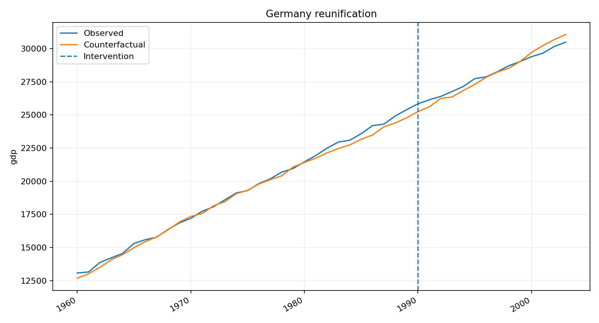
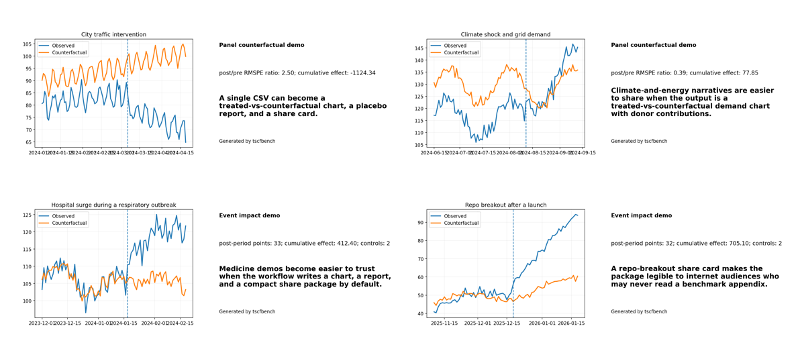
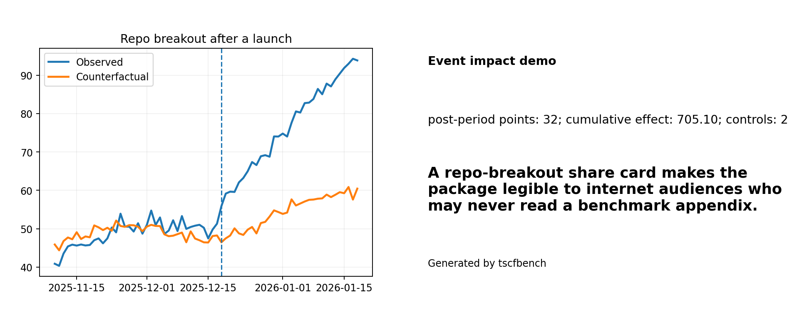
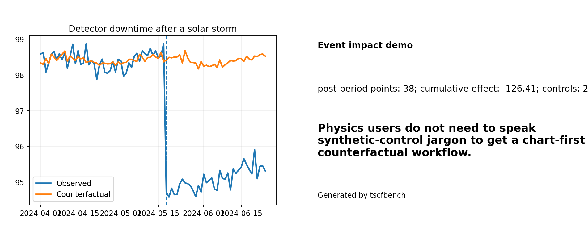
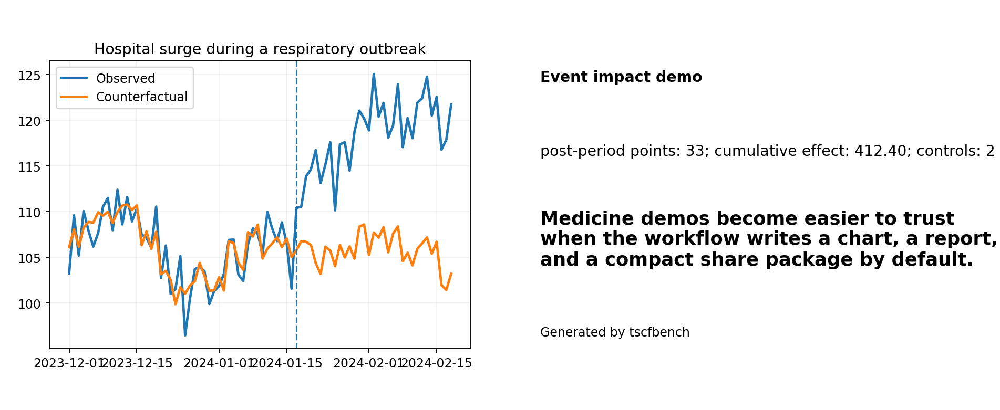

# tscfbench (v1.8.0)


**Turn a before/after time-series question into a counterfactual chart, a reproducible report, a share package, and an AI-agent-ready handoff.**



`tscfbench` is for the moment when a raw estimator is not enough: you want a chart, a report, a shareable package, and a machine-readable handoff under one reproducible spec.

## When to use this instead of a single estimator package

| If you need... | Use... |
|---|---|
| One specific estimator family and nothing else | a specialist package such as `tfcausalimpact`, `pysyncon`, `SCPI`, or `Darts` |
| One workflow surface across panel studies, event-style impact studies, demos, reports, and agent handoffs | `tscfbench` |
| Something you can show a colleague or post online, not just model output | `tscfbench` |

## 60-second quickstart

```bash
python -m pip install -e ".[starter]"
python -m tscfbench quickstart
python -m tscfbench doctor
```

That path is the single recommended onboarding path in v1.8: built-in backends, bundled snapshot data, clean report generation in a fresh environment, and immediate chart/report/share assets.

If you are installing from a release asset instead of a source checkout:

```bash
python -m pip install tscfbench-1.8.0-py3-none-any.whl matplotlib
python -m tscfbench quickstart
```

PyPI-first installation is prepared in this release, but the package is not published to PyPI from this environment.

## What you get on the first run

- A canonical study spec and results JSON.
- A Markdown report that works in a clean environment.
- Treated-vs-counterfactual, cumulative-impact, and share-card visuals.
- A `summary.json` file plus generated-files metadata and a narrow next-step path.

## Demo-first showcase



<table><tr><td></td><td></td><td></td></tr></table>

```bash
python -m tscfbench demo repo-breakout
python -m tscfbench demo detector-downtime
python -m tscfbench demo hospital-surge
python -m tscfbench demo minimum-wage-employment
python -m tscfbench demo viral-attention
```

These are the five most internet-legible paths in the repo today: breakout attention, detector downtime, hospital pressure, wage-policy divergence, and viral-attention spikes.

## Make something you can post online

```bash
python -m tscfbench make-share-package --demo-id repo-breakout
python -m tscfbench make-share-package --demo-id detector-downtime
```

That command writes a share package with a chart, share card, report, summary JSON, citation block, and manifest.

## Agent-first, but not agent-only

You can use the package from CLI, notebooks, Python scripts, or tool-calling runtimes. For agent workflows, start with the smallest tool surface first.

```bash
python -m tscfbench export-openai-tools --profile starter -o openai_tools_starter.json
python -m tscfbench list-tool-profiles
```

Use `starter` first. Promote to `minimal` or `research` only after the narrow path succeeds.

## Try now

- `docs/try-now.md` — zero-install gallery / Colab-ready entry points
- `docs/demo-gallery.md` — chart-first demos
- `docs/showcase-gallery.md` — share cards and downloadable example outputs
- `docs/plain-language-guide.md` — a non-jargon guide to counterfactual charts
- `docs/installation.md` — source checkout, wheel install, and PyPI-ready notes

## License

MIT
