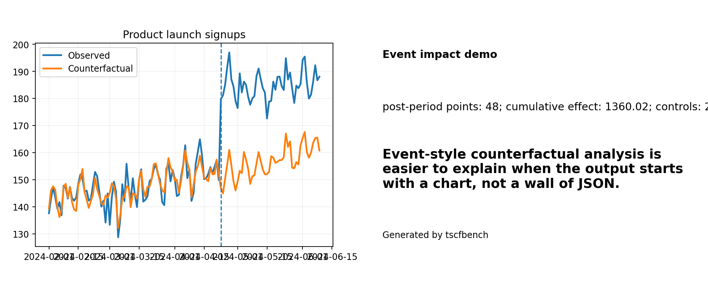

# Demo gallery

These demos are deliberately plain-language and shareable. They answer: *what can I show a colleague in one minute?*

Every demo can write JSON, Markdown, SVG/PNG charts, and a social-share card. Flagship demos also have ready-made downloadable share packages.

## Fastest beginner examples

### School attendance after a snow closure

- what goes in: One attendance series, a nearby-school control series, and the closure date.
- why it matters: This is a direct before/after question that educators can understand without learning causal-inference jargon first.
- bundled example file: `demo_school_closure_attendance.csv`

### Retail foot traffic after a store redesign

- what goes in: One treated store, several comparison stores, and the redesign date.
- why it matters: It shows the panel path on a business problem that looks nothing like a canonical policy case.
- bundled example file: `demo_retail_foot_traffic.csv`

### Website conversions after a landing-page redesign

- what goes in: One conversion series, peer conversions, search interest, and the redesign date.
- why it matters: It is the plainest possible product-growth explanation of an impact workflow.
- bundled example file: `demo_website_redesign_conversions.csv`

## Flagship shareable demos

Use these first if you want a chart that is easy to explain outside the causal-inference community.

### City traffic intervention

CSV in, report out: one treated city after a transport intervention.


- question: Did the treated city diverge from its donor-pool counterfactual after the intervention?
- domain: `transport`
- social angle: Show a colleague how one transport change turned into a city-level counterfactual chart in one command.
- intervention: `2024-03-06`
- family: `panel`

```bash
python -m tscfbench demo city-traffic
python -m tscfbench make-share-package --demo-id city-traffic
```

- sample download: [city-traffic share package](assets/downloads/city_traffic_share_package.zip)

Takeaway: A single CSV can become a treated-vs-counterfactual chart, a placebo report, and a share card.

### Product launch signups

One product launch, one treated metric, two control series.



- question: How many extra daily signups appeared after the feature launch?
- domain: `product`
- social angle: A launch story that product and growth teams can understand instantly.
- intervention: `2024-04-23`
- family: `impact`

```bash
python -m tscfbench demo product-launch
python -m tscfbench make-share-package --demo-id product-launch
```

Takeaway: Event-style counterfactual analysis is easier to explain when the output starts with a chart, not a wall of JSON.

### Heatwave and ER visits

Medicine / public health demo using one hospital metric before and after an extreme-heat event.


- question: How many excess ER visits appeared during the heatwave window?
- domain: `medicine`
- social angle: A clean excess-visits chart is much easier to share than a methods-heavy policy benchmark.
- intervention: `2024-07-14`
- family: `impact`

```bash
python -m tscfbench demo heatwave-health
python -m tscfbench make-share-package --demo-id heatwave-health
```

- sample download: [heatwave-health share package](assets/downloads/heatwave_health_share_package.zip)

Takeaway: Cross-disciplinary demos make the package legible to scientists who do not start from synthetic-control jargon.

### Climate shock and grid demand

Climate + energy demo: one treated grid region during a heat-driven demand spike.


- question: How much extra demand hit the treated grid during the climate shock window?
- domain: `climate`
- social angle: A climate-grid story that works for energy researchers, utilities, and LinkedIn audiences.
- intervention: `2024-08-11`
- family: `panel`

```bash
python -m tscfbench demo climate-grid
python -m tscfbench make-share-package --demo-id climate-grid
```

- sample download: [climate-grid share package](assets/downloads/climate_grid_share_package.zip)

Takeaway: Climate-and-energy narratives are easier to share when the output is a treated-vs-counterfactual demand chart with donor contributions.

### Hospital surge during a respiratory outbreak

Medicine demo: one hospital-system metric before and after a respiratory outbreak wave.


- question: How much ICU occupancy rose above counterfactual during the outbreak surge?
- domain: `medicine`
- social angle: An outbreak-surge case that reads like a hospital operations story, not a methods lecture.
- intervention: `2024-01-17`
- family: `impact`

```bash
python -m tscfbench demo hospital-surge
python -m tscfbench make-share-package --demo-id hospital-surge
```

- sample download: [hospital-surge share package](assets/downloads/hospital_surge_share_package.zip)

Takeaway: Medicine demos become easier to trust when the workflow writes a chart, a report, and a compact share package by default.

### Repo breakout after a launch

Internet-native public demo for launch attention, GH stars, or repo adoption.


- question: Was the repo's breakout real, or was it already on that path?
- domain: `open_source`
- social angle: The most shareable demo: was the launch a real breakout or just trend continuation?
- intervention: `2025-12-18`
- family: `impact`

```bash
python -m tscfbench demo repo-breakout
python -m tscfbench make-share-package --demo-id repo-breakout
```

- sample download: [repo-breakout share package](assets/downloads/repo_breakout_share_package.zip)

Takeaway: A repo-breakout share card makes the package legible to internet audiences who may never read a benchmark appendix.

### Detector downtime after a solar storm

Physics demo: one detector uptime series before and after a solar-storm event, with a reference detector and solar proxy as controls.


- question: How much detector uptime was lost after the solar storm relative to a counterfactual path?
- domain: `physics`
- social angle: A solar-storm downtime story makes the package legible outside policy and product analytics.
- intervention: `2024-05-18`
- family: `impact`

```bash
python -m tscfbench demo detector-downtime
python -m tscfbench make-share-package --demo-id detector-downtime
```

- sample download: [detector-downtime share package](assets/downloads/detector_downtime_share_package.zip)

Takeaway: Physics users do not need to speak synthetic-control jargon to get a chart-first counterfactual workflow.

### Regional employment after a minimum-wage change

Economics / social-science demo with one treated region and several donor regions.


- question: Did the treated region's employment index diverge after the wage-policy change?
- domain: `economics`
- social angle: A wage-policy chart is a more broadly legible social-science demo than canonical policy cases alone.
- intervention: `2024-08-04`
- family: `panel`

```bash
python -m tscfbench demo minimum-wage-employment
python -m tscfbench make-share-package --demo-id minimum-wage-employment
```

- sample download: [minimum-wage-employment share package](assets/downloads/minimum_wage_employment_share_package.zip)

Takeaway: An economics-style policy question can start with one command and end with a donor-based counterfactual chart plus share package.

### Viral attention spike

Social-science / public-attention demo with one treated attention index and two peer-topic controls.


- question: Was the public-attention spike a real breakout, or just continuation of the existing trend?
- domain: `social_science`
- social angle: A viral-attention case turns social-science language into a chart people actually repost.
- intervention: `2025-10-14`
- family: `impact`

```bash
python -m tscfbench demo viral-attention
python -m tscfbench make-share-package --demo-id viral-attention
```

- sample download: [viral-attention share package](assets/downloads/viral_attention_share_package.zip)

Takeaway: Public-attention narratives become much easier to share when the default output is a counterfactual chart instead of a methods appendix.

## Full demo catalog

Use the demos below when you want a fast domain-first example without starting from canonical policy studies.

### City traffic intervention

- family: `panel`
- domain: `transport`
- question: Did the treated city diverge from its donor-pool counterfactual after the intervention?
- dataset file: `demo_city_traffic.csv`
- beginner_friendly: `True`
- public_interest: `False`

```bash
python -m tscfbench demo city-traffic
```

### Product launch signups

- family: `impact`
- domain: `product`
- question: How many extra daily signups appeared after the feature launch?
- dataset file: `demo_product_launch.csv`
- beginner_friendly: `True`
- public_interest: `False`

```bash
python -m tscfbench demo product-launch
```

### Heatwave and ER visits

- family: `impact`
- domain: `medicine`
- question: How many excess ER visits appeared during the heatwave window?
- dataset file: `demo_heatwave_health.csv`
- beginner_friendly: `True`
- public_interest: `False`

```bash
python -m tscfbench demo heatwave-health
```

### Electricity demand after a grid shock

- family: `panel`
- domain: `engineering`
- question: How much did regional demand move after the grid shock?
- dataset file: `demo_electricity_shock.csv`
- beginner_friendly: `True`
- public_interest: `False`

```bash
python -m tscfbench demo electricity-shock
```

### Climate shock and grid demand

- family: `panel`
- domain: `climate`
- question: How much extra demand hit the treated grid during the climate shock window?
- dataset file: `demo_climate_grid.csv`
- beginner_friendly: `True`
- public_interest: `False`

```bash
python -m tscfbench demo climate-grid
```

### Hospital surge during a respiratory outbreak

- family: `impact`
- domain: `medicine`
- question: How much ICU occupancy rose above counterfactual during the outbreak surge?
- dataset file: `demo_hospital_surge.csv`
- beginner_friendly: `True`
- public_interest: `False`

```bash
python -m tscfbench demo hospital-surge
```

### GitHub repo breakout

- family: `impact`
- domain: `open_source`
- question: Did the launch create a real breakout in daily stars, or was growth already happening?
- dataset file: `demo_github_stars.csv`
- beginner_friendly: `False`
- public_interest: `True`

```bash
python -m tscfbench demo github-stars
```

### Repo breakout after a launch

- family: `impact`
- domain: `open_source`
- question: Was the repo's breakout real, or was it already on that path?
- dataset file: `demo_repo_breakout.csv`
- beginner_friendly: `False`
- public_interest: `True`

```bash
python -m tscfbench demo repo-breakout
```

### Crypto event study

- family: `impact`
- domain: `markets`
- question: How much of the BTC move looks event-driven rather than co-movement with the rest of the market?
- dataset file: `demo_crypto_event.csv`
- beginner_friendly: `False`
- public_interest: `True`

```bash
python -m tscfbench demo crypto-event
```

### Detector downtime after a solar storm

- family: `impact`
- domain: `physics`
- question: How much detector uptime was lost after the solar storm relative to a counterfactual path?
- dataset file: `demo_detector_downtime.csv`
- beginner_friendly: `True`
- public_interest: `False`

```bash
python -m tscfbench demo detector-downtime
```

### Regional employment after a minimum-wage change

- family: `panel`
- domain: `economics`
- question: Did the treated region's employment index diverge after the wage-policy change?
- dataset file: `demo_minimum_wage_employment.csv`
- beginner_friendly: `True`
- public_interest: `False`

```bash
python -m tscfbench demo minimum-wage-employment
```

### Viral attention spike

- family: `impact`
- domain: `social_science`
- question: Was the public-attention spike a real breakout, or just continuation of the existing trend?
- dataset file: `demo_viral_attention.csv`
- beginner_friendly: `False`
- public_interest: `True`

```bash
python -m tscfbench demo viral-attention
```
