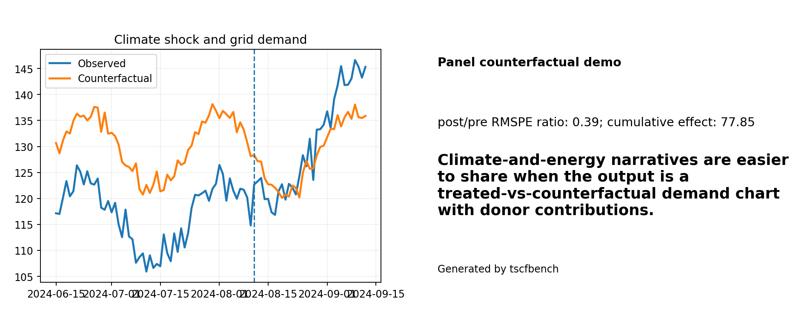
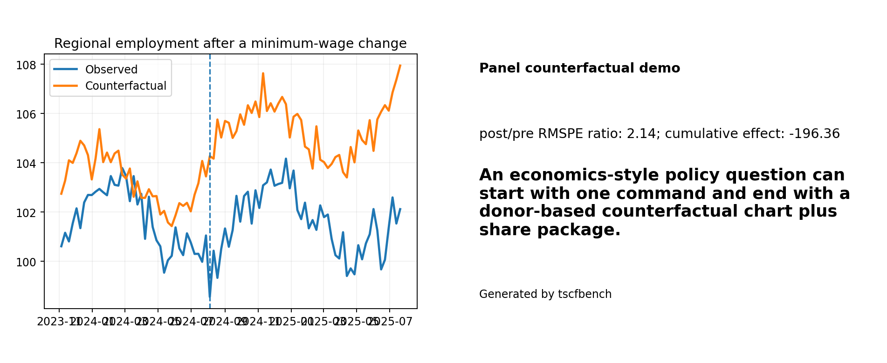
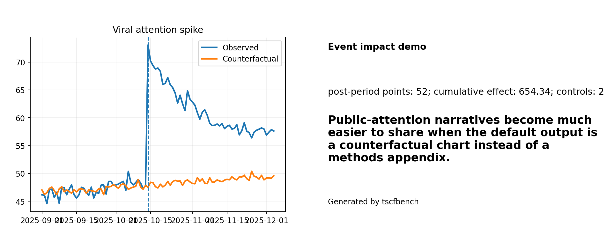

# Showcase gallery

These are the strongest ready-to-share assets in the repo today. Each demo below has a chart-first story, a report, and a downloadable share package.

## Repo breakout after a launch


A repo-breakout share card makes the package legible to internet audiences who may never read a benchmark appendix.

```bash
python -m tscfbench demo repo-breakout
python -m tscfbench make-share-package --demo-id repo-breakout
```

- download: [repo-breakout share package](assets/downloads/repo_breakout_share_package.zip)

## Detector downtime after a solar storm


Physics users do not need to speak synthetic-control jargon to get a chart-first counterfactual workflow.

```bash
python -m tscfbench demo detector-downtime
python -m tscfbench make-share-package --demo-id detector-downtime
```

- download: [detector-downtime share package](assets/downloads/detector_downtime_share_package.zip)

## Hospital surge during a respiratory outbreak


Medicine demos become easier to trust when the workflow writes a chart, a report, and a compact share package by default.

```bash
python -m tscfbench demo hospital-surge
python -m tscfbench make-share-package --demo-id hospital-surge
```

- download: [hospital-surge share package](assets/downloads/hospital_surge_share_package.zip)

## Climate shock and grid demand



Climate-and-energy narratives are easier to share when the output is a treated-vs-counterfactual demand chart with donor contributions.

```bash
python -m tscfbench demo climate-grid
python -m tscfbench make-share-package --demo-id climate-grid
```

- download: [climate-grid share package](assets/downloads/climate_grid_share_package.zip)

## Regional employment after a minimum-wage change



An economics-style policy question can start with one command and end with a donor-based counterfactual chart plus share package.

```bash
python -m tscfbench demo minimum-wage-employment
python -m tscfbench make-share-package --demo-id minimum-wage-employment
```

## Viral attention spike



Public-attention narratives become much easier to share when the default output is a counterfactual chart instead of a methods appendix.

```bash
python -m tscfbench demo viral-attention
python -m tscfbench make-share-package --demo-id viral-attention
```

