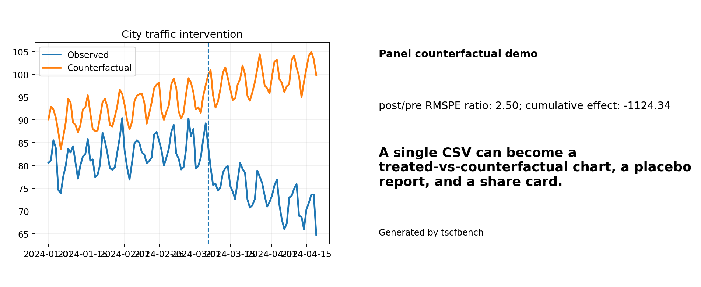

# City traffic tutorial

## Question

Did one treated city diverge from its donor-pool counterfactual after a transport intervention?

## Run it

```bash
python -m tscfbench demo city-traffic
python -m tscfbench make-share-package --demo-id city-traffic
```

## What you should expect

- a treated-vs-counterfactual traffic chart
- a cumulative-effect chart
- a share card
- a Markdown report with placebo diagnostics
- a downloadable share package



## Why this demo matters

This is the most legible **CSV in, report out** panel example in the repo. It works well for transport policy, urban operations, retail foot traffic, or school attendance questions.

## How to adapt it

Bring your own CSV with one treated unit, a time column, an outcome column, and donor units. Then switch from the demo to `python -m tscfbench run-csv-panel ...`.
