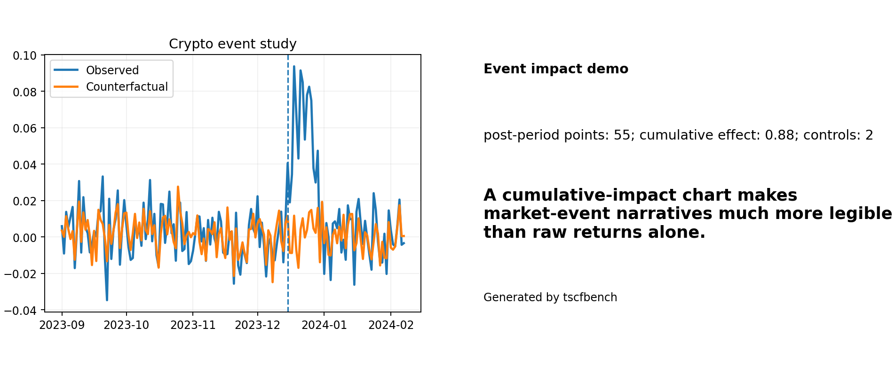

# Crypto event impact with CoinGecko

This tutorial shows how to build a public crypto event case with **CoinGecko** price, market-cap, and volume data.



## Why this case works

Crypto already has a large audience, and event windows naturally invite counterfactual questions: *what would price or volume have looked like without the event?*

## One-command demo

```bash
python -m tscfbench demo crypto-event
```

## Minimal example

```python
from tscfbench.datasets import load_coingecko_market_chart, make_event_impact_case, to_log_returns

btc = load_coingecko_market_chart("bitcoin")
eth = load_coingecko_market_chart("ethereum")
sol = load_coingecko_market_chart("solana")

btc_r = to_log_returns(btc, value_col="price", out_col="value")[["date", "value"]].dropna()
eth_r = to_log_returns(eth, value_col="price", out_col="value")[["date", "value"]].dropna()
sol_r = to_log_returns(sol, value_col="price", out_col="value")[["date", "value"]].dropna()

case = make_event_impact_case(
    btc_r,
    {"eth": eth_r, "sol": sol_r},
    intervention_t="2024-01-11",
)
```

## Notes

- For markets, returns or spreads are usually more defensible than raw prices.
- You can also use `market_cap` or `total_volume` as the treated series.
