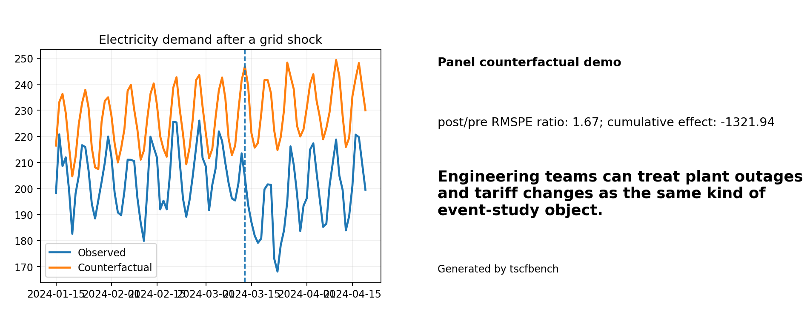

# Tutorial: electricity demand after a grid shock

This is the engineering operations demo.



## Run it

```bash
python -m tscfbench demo electricity-shock
```

## Question

How much did demand in the treated region diverge from its donor-based counterfactual after the outage or tariff shock?

## What this writes

- `panel_metrics.json`
- `panel_report.md`
- `panel_prediction_frame.csv`
- treated-vs-counterfactual PNG/SVG
- cumulative-impact PNG/SVG
- donor-contributions PNG/SVG
- share-card PNG/SVG

## Why this tutorial exists

It gives engineering and energy users a concrete panel example that feels closer to operations than to policy research.

## Real-world variants

The same pattern works for plant outages, tariff changes, regional demand shocks, and maintenance windows.
