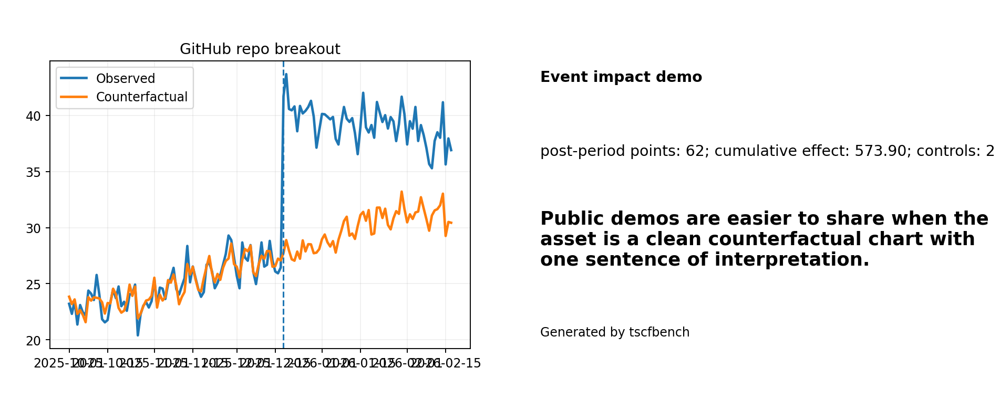

# GitHub stars as an event-impact case

This tutorial shows how to use **GitHub-star history** as a public-facing event-study dataset.



## Why this case works

GitHub stars are public, easy to explain, and directly connected to attention and adoption. That makes them ideal for demos around launches, integrations, security news, or viral social-media moments.

## Suggested workflow

1. Fetch a repo's daily star history.
2. Build a donor pool of peer repos.
3. Choose an event date.
4. Convert the aligned series into an `ImpactCase` or a panel benchmark.
5. Render a compact report and a shareable chart.

## One-command demo

```bash
python -m tscfbench demo github-stars
```

## Minimal example

```python
from tscfbench.datasets import load_github_star_history, make_event_impact_case

outcome = load_github_star_history("openclaw", "openclaw")
control_a = load_github_star_history("microsoft", "playwright")
control_b = load_github_star_history("langchain-ai", "langchain")

case = make_event_impact_case(
    outcome.rename(columns={"stars_new": "value"})[["date", "value"]],
    {
        "playwright": control_a.rename(columns={"stars_new": "value"})[["date", "value"]],
        "langchain": control_b.rename(columns={"stars_new": "value"})[["date", "value"]],
    },
    intervention_t="2026-02-20",
)
```

## Notes

- For attention studies, **daily new stars** often make a better outcome than cumulative stars.
- For bigger benchmark studies, GH Archive can be a better source than the GitHub API because it scales to many repos.
