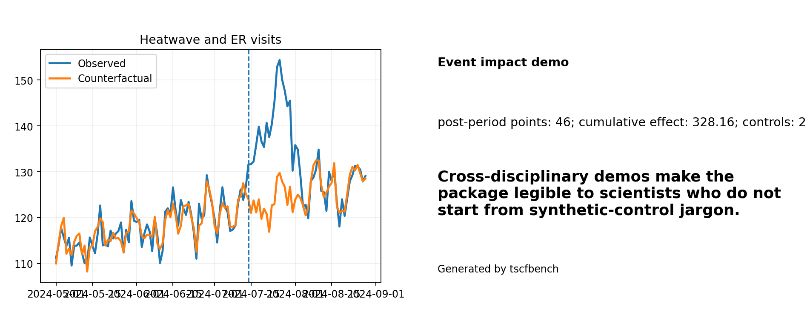

# Tutorial: heatwave and ER visits

This is the medicine / public-health demo.



## Run it

```bash
python -m tscfbench demo heatwave-health
```

## Question

How many excess ER visits appeared during the heatwave window compared with a counterfactual path?

## What this writes

- `impact_metrics.json`
- `impact_report.md`
- `impact_prediction_frame.csv`
- treated-vs-counterfactual PNG/SVG
- cumulative-impact PNG/SVG
- share-card PNG/SVG

## Why this tutorial exists

It shows that the package is not only for policy case studies or GitHub/crypto demos. It can also package a hospital-style time-series event study in a way clinicians and public-health researchers can read.

## Typical real-data upgrade

Pair a hospital admissions series with weather covariates or neighboring-city utilization controls, then re-run the same CLI path with your own CSV.
